# WAMCPanel — Web-based Minecraft Control Panel

WAMCPanel is a modern, premium, state-of-the-art server administration dashboard. It allows you to host, manage, monitor, and configure multiple Minecraft server instances dynamically via Docker containers. Built with **Next.js 15, Express, TypeScript, Prisma, and Dockerode**.

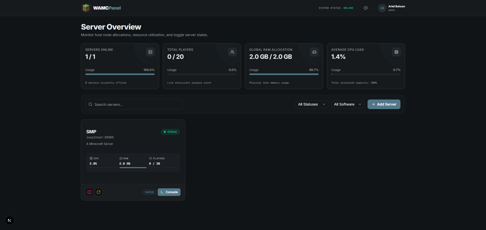

---

## 📸 Screenshots Gallery

<details>
<summary><b>🖥️ Server Dashboard & Overview</b></summary>
<br>

#### Server Dashboard / List View


#### Server Instance Overview & Node Stats
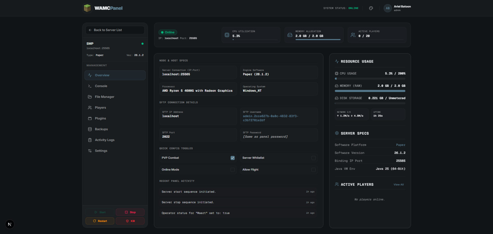
</details>

<details>
<summary><b>🎮 Server Console & Controls</b></summary>
<br>

#### In-browser Interactive Console & Real-time Log Streaming
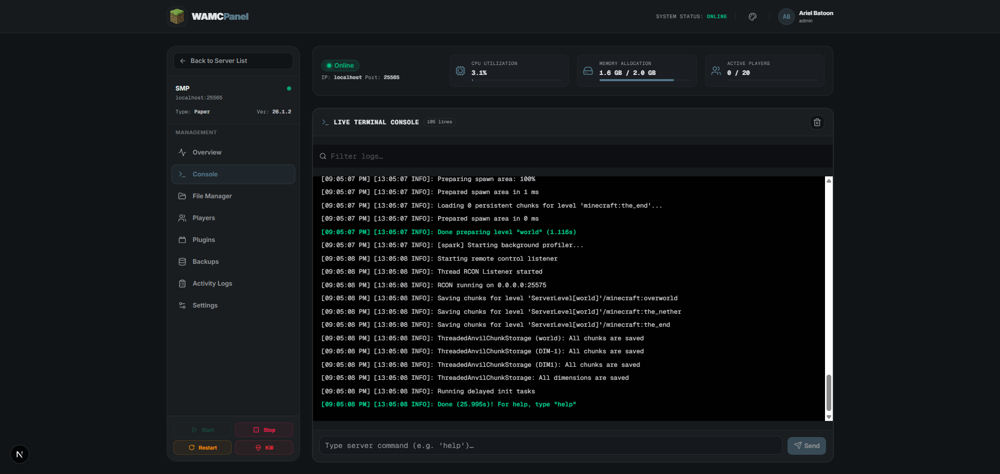
</details>

<details>
<summary><b>📁 File Manager & Configuration</b></summary>
<br>

#### Web File Explorer (Upload, Edit, Compress, Extract)
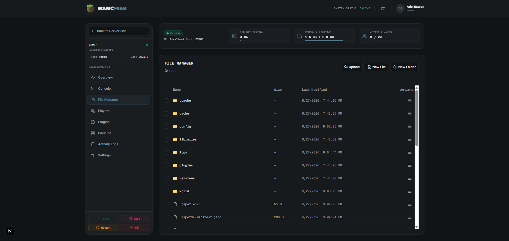
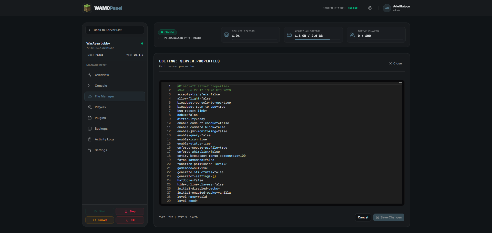
</details>

<details>
<summary><b>🔌 Plugins & Player Management</b></summary>
<br>

#### Easy Plugins Search & Toggle Installer
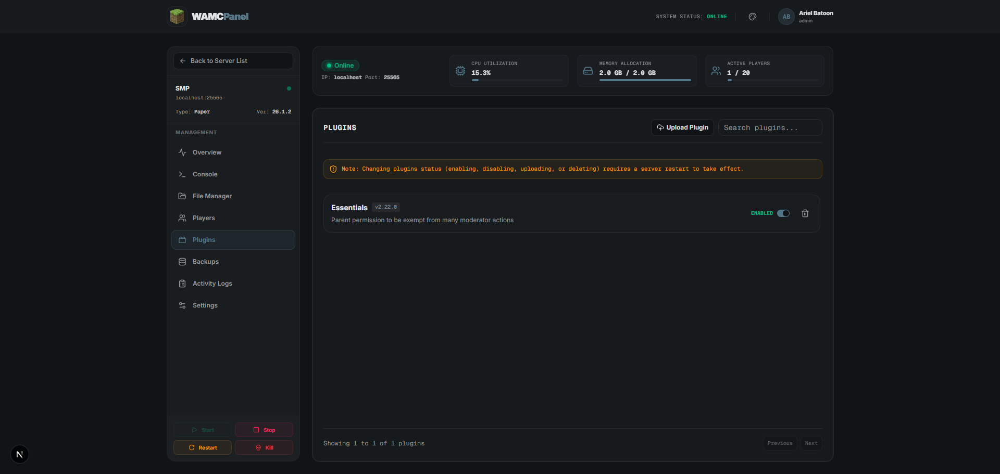

#### Active Players tracking (Ping & OP status)
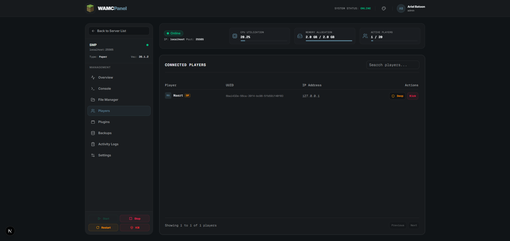
</details>

<details>
<summary><b>💾 Backups, Settings & System Logs</b></summary>
<br>

#### Backup Creation & Restoration Manager
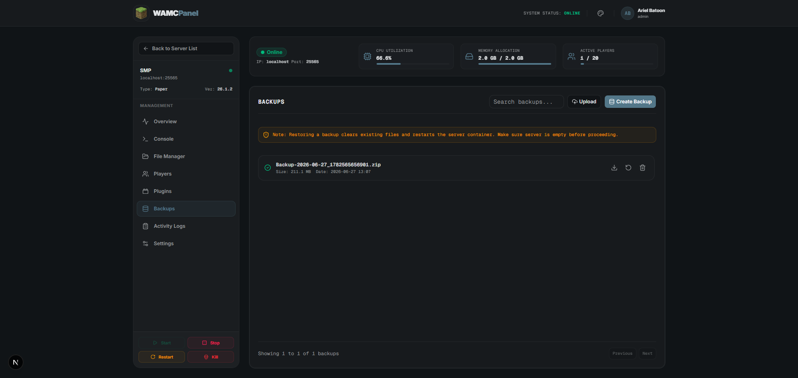

#### Detailed Server Properties Editor
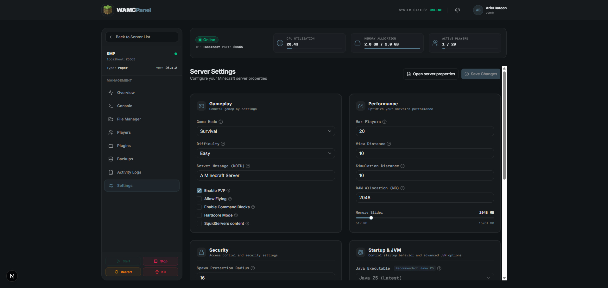

#### Security & Audit Activity Logs
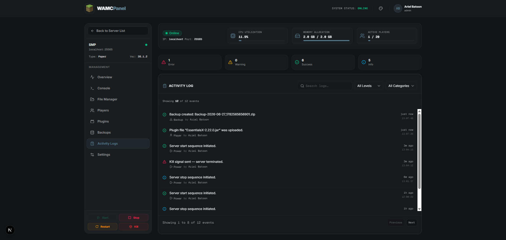

#### Multi-step Server Deployment Wizard
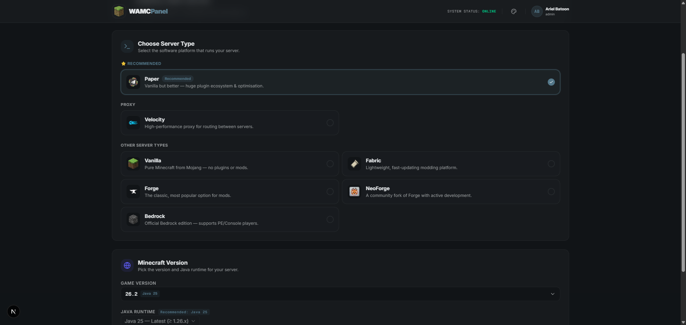
</details>

---

## ✨ Core Features

*   **⚡ Multi-Instance Deployment**: Spin up, configure, and delete Minecraft servers running different software engines (Vanilla, Paper, Fabric, Velocity, etc.) and versions.
*   **📊 Real-time Performance Indicators**: Live CPU, RAM, and disk storage consumption monitors for the host VPS and each individual game container.
*   **👥 Active Players Tracking**: Real-time connected players lists complete with ping metrics and operator status.
*   **🐚 Interactive Console**: In-browser interactive console, terminal logs streams, SFTP access details, and power buttons (Start, Stop, Restart, Kill).
*   **📂 Full File Explorer**: In-browser directory explorer for editing files, uploading, zipping, and extracting zip files.
*   **🔌 Plugin Installer**: View, toggle, and upload plugins dynamically for Paper/Spigot instances.
*   **💾 Backup Management**: Create, download, and restore zipped server backups directly from the web interface.
*   **🛡️ Activity Logs**: Audit history for user actions to keep track of panel activities.

---

## 🛠️ Technology Stack

*   **Frontend**: Next.js 15 (App Router), TypeScript, TailwindCSS, Lucide Icons, Shadcn/UI
*   **Backend**: Node.js, Express, TypeScript, Socket.io (Real-time logs & console)
*   **Database & ORM**: PostgreSQL, Redis, Prisma ORM
*   **Containers Management**: Docker & Dockerode API

---

## 🚀 Production VPS Deployment (For Users)

To deploy WAMCPanel on any Linux VPS (Ubuntu/Debian) automatically:

### 1. Initialize the Environment
Run our automated bootstrap script on your hosting server to install Docker, Node.js, Git, and configure group permissions:

```bash
curl -fsSL https://raw.githubusercontent.com/arielbatoon09/wamcpanel/master/scripts/installation.sh | sudo bash
```

### 2. Configure Environment Variables
Open the auto-created `.env` file in the root directory:
```bash
cd /opt/wamcpanel
nano .env
```
Ensure you update the following critical variables for production security:
*   `JWT_SECRET`: Change this to a secure, random string (e.g. `openssl rand -hex 32`) to sign user sessions.
*   `DB_PASSWORD`: Set a strong database password to secure your PostgreSQL instance.
*   `DATABASE_URL`: Update the password section in the connection string to match your `DB_PASSWORD`. Note that if your password contains special characters (like `@`), they must be percent-encoded (e.g., `@` becomes `%40`).

*(All host, client, and WebSocket routing URLs are automatically resolved at runtime, making the deployment fully zero-config!)*

### 3. Start WAMCPanel via Docker Compose
Build and run the entire stack (PostgreSQL, Redis, Backend, and Frontend containers) in detached daemon mode:
```bash
docker compose up -d --build
```
The panel dashboard will now be accessible at `http://your-vps-ip:3000`.

---

## 🛠️ Local Development Setup

To run and contribute to the WAMCPanel repository locally:

### Prerequisites
*   **Docker Desktop** running and configured.
*   **Node.js** (v20 LTS recommended).
*   **Git**.

### 1. Clone & Install Dependencies
Clone the repository to your local machine:
```bash
git clone https://github.com/arielbatoon09/wamcpanel.git
cd wamcpanel
```
Install dependencies individually for the backend and frontend:
```bash
# Backend dependencies
cd backend && npm install

# Frontend dependencies
cd ../frontend && npm install
```

### 2. Configure Environment Variables & Host Key
Rename the backend environment template and customize it:
*   **Backend**: Rename `backend/.env.example` to `backend/.env` (no environment file is needed for the frontend).

#### SFTP Host Key
The SFTP server requires a host key (`backend/sftp_host_key`). It is automatically generated when you start the server for the first time, but you can also generate it manually or regenerate it at any time:
```bash
# Navigate to backend directory and run keygen script
cd backend
npm run sftp:keygen
```

### 3. Initialize Database & Prisma
Under `/backend`, generate the Prisma client and run the database migrations:
```bash
cd ../backend
npx prisma generate
npx prisma migrate dev --name init
```

### 4. Run Development Servers
Start the dev servers by running `npm run dev` in their respective folders:
*   **Backend Web server**:
    ```bash
    cd backend && npm run dev
    ```
    *(Runs on `http://localhost:8000`)*
*   **Frontend Hot Reload**:
    ```bash
    cd frontend && npm run dev
    ```
    *(Runs on `http://localhost:3000`)*

---

## 🤝 Contribution Guidelines

We welcome contributions to WAMCPanel! To submit changes:

1.  **Fork** the repository and create your feature branch:
    ```bash
    git checkout -b feature/amazing-feature
    ```
2.  **Commit** your changes following standard guidelines:
    ```bash
    git commit -m "feat: add amazing feature details"
    ```
3.  **Push** to the branch:
    ```bash
    git push origin feature/amazing-feature
    ```
4.  Open a **Pull Request** explaining your implementation details.

---

## 📄 License

This project is licensed under the MIT License — see the [LICENSE](LICENSE) file for details.